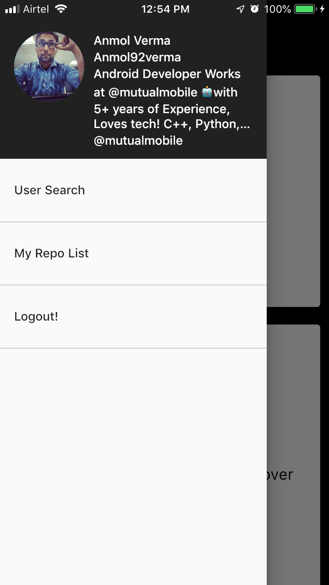
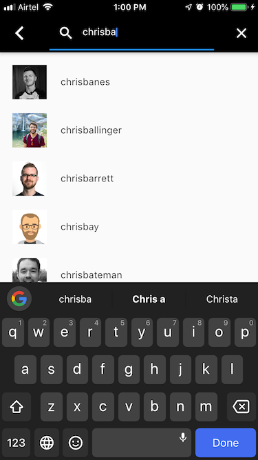
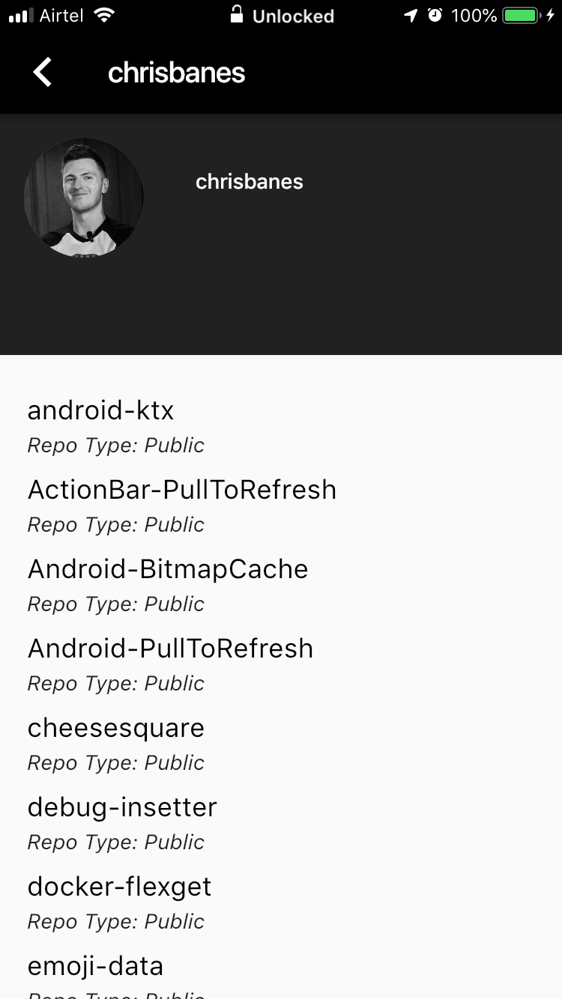
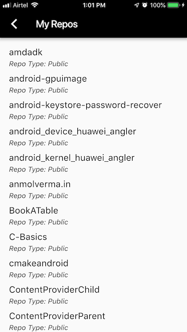
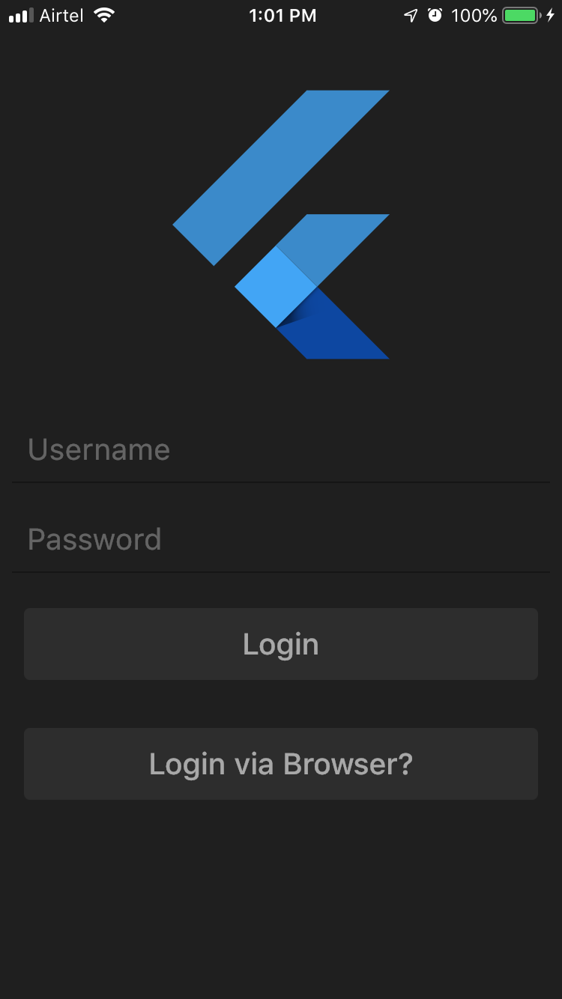
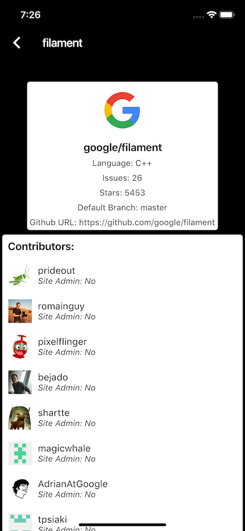

# FLutter Github Client

A new Flutter application for github client.

For reference go to the following URL!
https://developer.github.com/apps/building-oauth-apps/authorizing-oauth-apps/

##ScreenShots

## Getting Started

1. Authorization with OAuth! *Done*
1a). Users are redirected to request their GitHub identity
GET https://github.com/login/oauth/authorize

1b). Users are redirected back to your site by GitHub
POST https://github.com/login/oauth/access_token

1c). Use the access token to access the API with the accessToken!

2. Authorization with login/password *Done*

3. User Starred Repos and repos *Done*

4. Search Users and view user profiles *Done*

5. View Organizations *Pending*

## License

This project is licensed under the Apache 2.0 License - see the [LICENSE](LICENSE) file for details